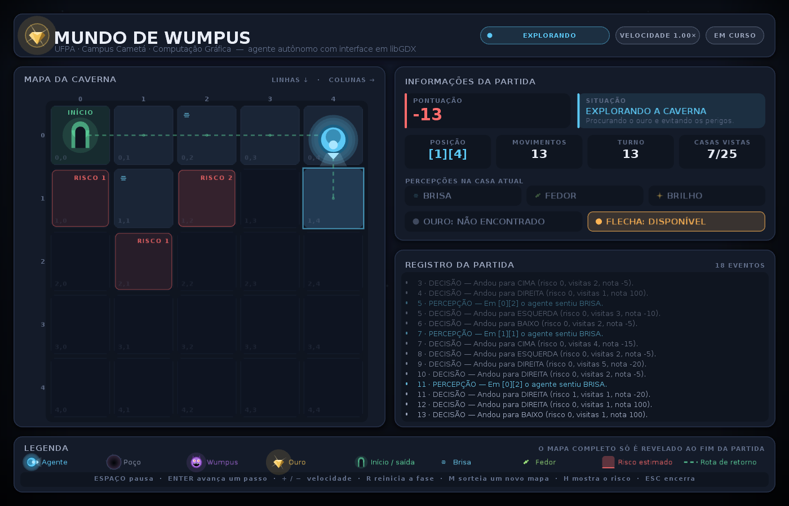
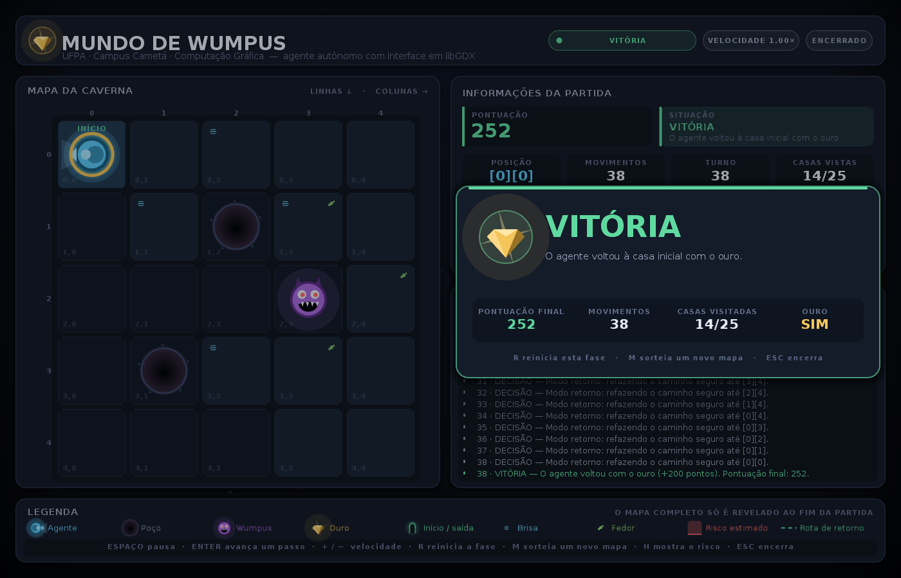
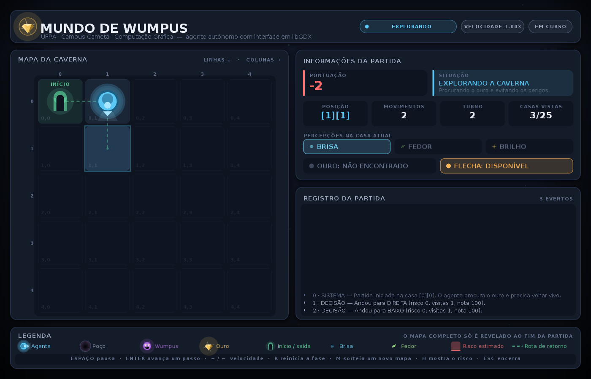

# Mundo de Wumpus — interface gráfica com libGDX

Trabalho final de **Computação Gráfica**
Universidade Federal do Pará · Campus Cametá · Faculdade de Sistemas de Informação
Professor: Keventon Guimarães

Versão gráfica do Mundo de Wumpus construído ao longo das aulas 1 a 7. O mapa é
desenhado como uma grade de linhas e colunas e, a cada passo, a janela mostra
onde o agente está, o que ele percebe, o que decidiu e por quê — sem que seja
preciso digitar nada para avançar.



---

## 1. Como executar

Requisitos: **JDK 17 ou superior** (testado com o OpenJDK 25). O Gradle Wrapper
já acompanha o projeto e baixa sozinho tudo de que precisa — não é necessário
instalar Gradle nem a libGDX à parte.

### Pela linha de comando

```bash
# Linux e macOS
./gradlew run

# Windows
gradlew.bat run
```

### Gerando um executável único

```bash
./gradlew jarCompleto
java -jar build/libs/WumpusWorld-1.0-completo.jar
```

O JAR gerado embute a libGDX e as bibliotecas nativas de Windows, Linux e
macOS: basta ter o Java instalado para rodar em qualquer uma das três.

### Modo console (a versão em texto das aulas)

```bash
./gradlew console
# ou
java -jar build/libs/WumpusWorld-1.0-completo.jar --console
```

### Abrindo numa IDE

O projeto é um projeto Gradle padrão. No **NetBeans**, use
*File → Open Project* e aponte para a pasta do projeto; no **IntelliJ IDEA** ou
no **Eclipse**, use *Open / Import* como projeto Gradle. A classe principal é
`wumpusworld.Main`.

> No macOS, ao rodar pela IDE, acrescente `-XstartOnFirstThread` às opções da
> máquina virtual. Pelo `./gradlew run` isso já é configurado automaticamente.

### Testes automatizados

```bash
./gradlew test
```

São 29 testes sobre as regras do jogo (percepções, flecha, memória do agente e
os três desfechos possíveis da partida).

---

## 2. A biblioteca gráfica escolhida

**libGDX 1.14.2**, com o backend de desktop **LWJGL 3** e a extensão
**gdx-freetype** para as fontes.

Por que libGDX em vez de Java Swing:

| Necessidade do trabalho | O que a libGDX oferece |
|---|---|
| Atualizar a tela em intervalos regulares, sem travar a janela | Laço de renderização próprio, a 60 quadros por segundo, com o tempo decorrido entregue a cada quadro |
| Acompanhar cada movimento | Interpolação suave entre a casa de origem e a de destino, em vez de o agente "pular" de célula em célula |
| Desenhar o mapa e os elementos | `ShapeRenderer` para geometria e `SpriteBatch` para texto, com antisserrilhamento por multiamostragem |
| Redimensionar a janela sem quebrar o layout | `FitViewport`: o layout é descrito numa resolução virtual fixa e reescalado para a janela real |
| Texto nítido com acentuação | `gdx-freetype` rasteriza a fonte no tamanho exato de cada painel |

As dependências estão declaradas em `build.gradle.kts` e são baixadas do Maven
Central na primeira execução.

### Recursos gráficos utilizados

- **Fontes**: `DejaVuSans.ttf` e `DejaVuSans-Bold.ttf` (licença livre), em
  `assets/fontes/`. Detalhes em `assets/fontes/LEIA-ME.txt`.
- **Ícone da janela**: `assets/icone/icone-{32,64,128}.png`.
- **Todo o restante é desenhado por geometria em tempo de execução.** O agente,
  os poços, o Wumpus, o ouro, o portal de saída e os selos de brisa e fedor são
  compostos por círculos, triângulos, anéis e polígonos calculados a partir do
  centro e do tamanho da casa (veja `grafico/Icones.java`). Isso mantém o
  projeto sem imagens externas, deixa os desenhos nítidos em qualquer escala e
  permite animá-los apenas variando o tempo.

---

## 3. De linhas e colunas para posições na tela

Esta é a conversão central do trabalho, e ela acontece num lugar só:
`grafico/PainelTabuleiro.java`.

A matriz do mundo é indexada por **linha** (contada de cima para baixo) e
**coluna** (da esquerda para a direita). A libGDX, por outro lado, usa um
sistema de coordenadas cuja origem fica no **canto inferior esquerdo**, com o
eixo Y crescendo **para cima**. As duas convenções são opostas no eixo vertical.

```java
passo = lado + ESPACO;          // tamanho da casa mais o vão entre elas

x(coluna) = origemX + coluna * passo;
y(linha)  = origemY + (TAMANHO - 1 - linha) * passo;
```

- **Colunas → eixo X.** A coluna cresce no mesmo sentido do X, então a conversão
  é direta: basta multiplicar o índice pelo passo e somar a origem da grade.
- **Linhas → eixo Y, invertidas.** O termo `(TAMANHO - 1 - linha)` é o que faz a
  linha 0 aparecer no **alto** da janela. Sem ele, o mapa apareceria de cabeça
  para baixo em relação ao mapa impresso no modo console.

O centro de uma casa, usado para posicionar os ícones, é
`x(coluna) + lado/2` e `y(linha) + lado/2`.

### Como o tamanho da casa é calculado

O lado da casa não é fixo: ele é deduzido do espaço disponível, para que a
grade continue quadrada e centralizada em qualquer tamanho de janela.

```java
Area interna   = areaDoPainel.encolher(MARGEM_INTERNA);
disponivelX    = interna.largura - REGUA;                      // régua das linhas
disponivelY    = interna.altura  - REGUA - FAIXA_DO_TITULO;    // régua das colunas

lado  = min((disponivelX - ESPACO * (N-1)) / N,
            (disponivelY - ESPACO * (N-1)) / N);
grade = lado * N + ESPACO * (N-1);

origemX = interna.x + REGUA + (disponivelX - grade) / 2;
origemY = interna.y          + (disponivelY - grade) / 2;
```

### Animação entre duas casas

Entre dois passos, o agente não salta: a posição desenhada é interpolada entre
o centro da casa de origem e o da casa de destino.

```java
fator = suavizar(progressoDoPasso);          // 0 → 1, com aceleração suave
cx    = centroX(origem.coluna) + (centroX(destino.coluna) - centroX(origem.coluna)) * fator;
cy    = centroY(origem.linha)  + (centroY(destino.linha)  - centroY(origem.linha))  * fator;
```

---

## 4. Organização do código

O projeto é dividido em três camadas, e a dependência aponta sempre numa única
direção: a apresentação conhece as regras, mas **as regras não conhecem a
apresentação**.

```
src/main/java/wumpusworld/
│
├── Main.java                  Escolhe entre a janela gráfica e o modo console
│
├── nucleo/                    AS REGRAS — nenhuma dependência de libGDX
│   ├── Mundo.java             O mapa: percepções, flecha, casas visitadas
│   ├── AgenteInteligente.java Memória, estimativa de risco e decisões
│   ├── Partida.java           O árbitro: executa um passo por chamada
│   ├── Direcao.java           As quatro direções da matriz
│   ├── Posicao.java           Coordenada linha/coluna
│   ├── Percepcoes.java        Brisa, fedor e brilho
│   ├── Decisao.java           Para onde o agente decidiu ir, e por quê
│   ├── DisparoDeFlecha.java   Origem, destino e resultado de um tiro
│   ├── EventoJogo.java        Uma linha do registro da partida
│   ├── TipoEvento.java        Categoria do evento (usada para colorir)
│   └── Situacao.java          Em andamento, vitória, morte ou limite
│
├── console/
│   └── ModoConsole.java       A versão em texto das aulas 1 a 7
│
└── grafico/                   A APRESENTAÇÃO — só desenha, nunca decide
    ├── LancadorDesktop.java   Configuração da janela (LWJGL 3)
    ├── JogoWumpus.java        Aplicação libGDX
    ├── TelaDaPartida.java     Layout, relógio da simulação e ordem de desenho
    ├── PainelTabuleiro.java   O mapa em grade  ← conversão matriz → tela
    ├── PainelStatus.java      Informações da partida
    ├── PainelRegistro.java    Registro rolante dos acontecimentos
    ├── PainelRodape.java      Legenda e atalhos
    ├── BarraSuperior.java     Cabeçalho e estado geral
    ├── CamadaResultado.java   Cartão de encerramento
    ├── Icones.java            Desenho vetorial dos elementos
    ├── Desenho.java           Primitivas: cantos arredondados, anéis, sombras
    ├── Efeitos.java           Tremor, clarões, ondas e textos flutuantes
    ├── Paleta.java            Identidade visual
    ├── Area.java              Retângulo de layout
    └── EstadoDaAnimacao.java  O momento da animação, passado aos painéis
```

### O que mudou em relação à versão de console

As regras foram **preservadas**: os mesmos pesos, os mesmos bônus e penalidades,
a mesma ordem de perceber, deduzir, atirar, mover e resolver a casa. O que mudou
foi a arrumação:

1. O laço que vivia dentro do `main` virou `Partida.executarPasso()`, que executa
   **um** passo por chamada. O console chama esse método num laço com pausa; a
   janela chama o mesmo método a cada intervalo do relógio de animação. Não há
   regra duplicada entre as duas versões.
2. As mensagens que eram impressas com `System.out.println` viraram objetos
   `EventoJogo`, que o console formata como texto e a janela desenha coloridos.
3. `Mundo` e `AgenteInteligente` não imprimem mais nada: só respondem consultas.
4. Os vetores paralelos de direções viraram o enum `Direcao`, e os pares de
   `int linha, int coluna` viraram o record `Posicao`.

---

## 5. O que a aplicação mostra

### Mapa em grade
Grade 5 × 5 com as casas alinhadas, numeradas por linha e por coluna nas réguas
superior e esquerda, e com a coordenada `linha,coluna` discreta em cada casa.

### Elementos e legenda
Agente, poços, Wumpus, ouro e o portal de saída, cada um com um desenho próprio
e explicado na legenda do rodapé — que usa exatamente os mesmos desenhos do
tabuleiro, em escala menor.

### Movimento automático
O agente anda sozinho. A cada quadro, o tempo decorrido é somado a um relógio;
quando o relógio atinge o intervalo configurado (0,62 s na velocidade normal), a
tela pede um passo à partida. É o equivalente, em libGDX, ao
`javax.swing.Timer` sugerido no enunciado — e, como a janela nunca fica
bloqueada esperando, a interface continua respondendo o tempo todo.

### Informações da partida
Posição atual, percepções da casa (brisa, fedor e brilho, acesas somente quando
existem), quantidade de movimentos, turno, casas já vistas, pontuação e a posse
de ouro e de flecha.

### O que o agente pensa
As casas ainda não visitadas que o agente **suspeita** serem perigosas recebem
um véu vermelho proporcional ao risco que ele estimou, com o valor numérico no
canto. A rota segura memorizada para o retorno aparece como uma linha tracejada.
Nada disso revela o mapa: são apenas as deduções do próprio agente, lidas de sua
memória.

### Registro da partida
Cada percepção, decisão, disparo e consequência é registrado com o número do
turno e colorido pela natureza do acontecimento.

### Resultado
Quando o agente morre, volta com o ouro ou atinge o limite de exploração, o
**mapa completo é revelado** e um cartão mostra o desfecho, a pontuação final,
os movimentos e as casas visitadas.



---

## 6. Como a separação entre regra e desenho é garantida

O enunciado pede que a parte gráfica represente o estado do jogo sem consultar
as posições ocultas para decidir pelo agente. No código, isso é assegurado
assim:

- O pacote `nucleo` **não importa nada de libGDX**. Ele compila e é testado sem
  que exista janela alguma.
- O agente só recebe informação do mundo através de
  `Mundo.percepcoesEm(posicao)`, que devolve apenas brisa, fedor e brilho.
- O tabuleiro desenha o conteúdo de uma casa somente quando
  `mundo.foiVisitada(linha, coluna)` é verdadeiro — ou quando
  `partida.mapaDeveSerRevelado()` passa a ser verdadeiro, o que só acontece
  depois que a partida termina.
- O véu de risco vem de `agente.getRisco(linha, coluna)`, isto é, da **memória do
  agente**, e não do mapa real.
- Nenhuma classe de `grafico` chama métodos que alterem as regras. A única coisa
  que a tela pede à partida é `executarPasso()`.

---

## 7. Controles (recurso extra)

O enunciado não exige controle por teclado, e a simulação anda sozinha do começo
ao fim. Os atalhos abaixo foram acrescentados para facilitar a apresentação do
trabalho:

| Tecla | Ação |
|---|---|
| `ESPAÇO` | Pausa e retoma a simulação |
| `ENTER` | Avança exatamente um passo (útil para explicar uma decisão) |
| `+` / `−` | Aumenta e diminui a velocidade (0,25× a 4×) |
| `R` | Reinicia a mesma fase |
| `M` | Sorteia uma fase nova |
| `H` | Mostra ou esconde o mapa de risco estimado |
| `ESC` | Encerra a aplicação |

O sorteio de fases (`M`) não altera nenhuma regra: muda apenas as posições dos
dois poços, do Wumpus e do ouro. O gerador recusa mapas em que o ouro seja
inalcançável e nunca coloca perigos na casa inicial nem nas suas vizinhas, de
modo que a partida continue sendo vencível.

---

## 8. Regras e pontuação

| Situação | Pontos |
|---|---|
| Cada movimento | −1 |
| Recolher o ouro | +100 |
| Voltar à casa inicial com o ouro | +200 |
| Matar o Wumpus (com a flecha ou no corpo a corpo) | +50 |
| Disparar a flecha | −10 |
| Morrer | −100 |

A partida termina quando o agente morre, quando volta à casa inicial com o ouro
ou quando atinge 180 movimentos sem ter encontrado o ouro. Encontrado o ouro, o
limite deixa de valer: o caminho de retorno já é conhecido e sempre pode ser
concluído.

### Como o agente decide

Para cada casa vizinha, o agente calcula uma nota e escolhe a maior; empates são
resolvidos por sorteio.

```
nota = (casa nunca visitada ? 100 : 0)
     − risco estimado    × 120
     − vezes já visitada × 5
```

O risco é construído pelas percepções: ao sentir brisa ou fedor numa casa, o
agente aumenta a suspeita sobre as vizinhas ainda desconhecidas — uma vez por
casa, para que ficar rodando no mesmo lugar não inflacione a estimativa. Ao
sentir fedor tendo ainda a flecha, ele atira na vizinha desconhecida mais
suspeita. Ao recolher o ouro, troca de objetivo e refaz o caminho memorizado,
do qual as voltas em círculo já foram descartadas.

---

## 9. Capturas

| Início da exploração | Durante a partida | Fim, com o mapa revelado |
|---|---|---|
|  |  |  |
