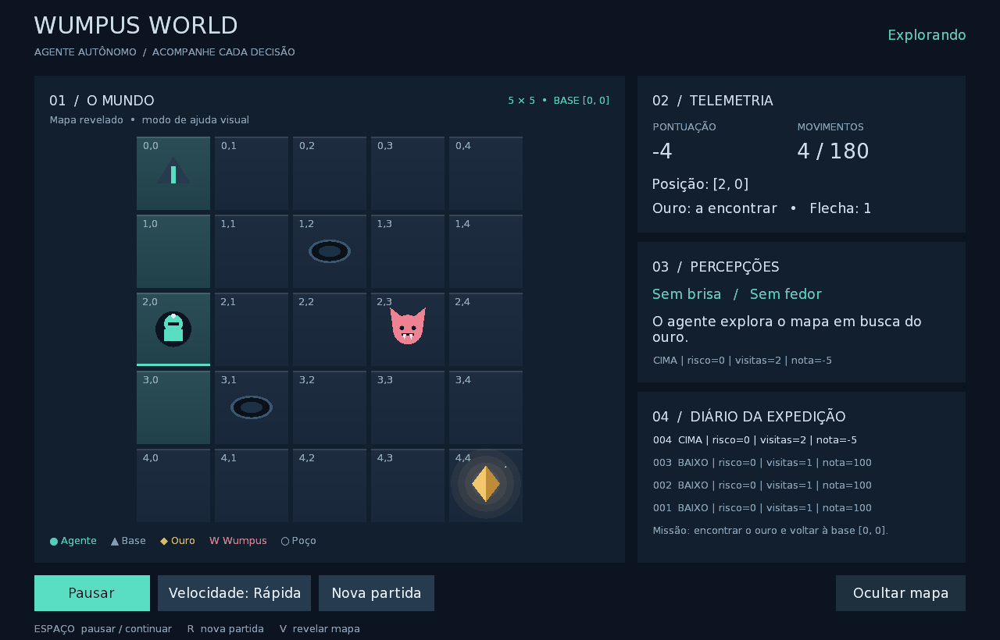

# Wumpus World — versão com computação gráfica

## 1. Objetivo e referência

Esta versão transforma a demonstração de terminal em uma aplicação desktop 2D que mostra, passo a passo, o agente autônomo explorando o mapa. O agente interpreta as percepções, decide quando disparar a flecha e volta à base após coletar o ouro; a janela apenas representa esse estado.

As mudanças descritas aqui são relativas ao commit `cc40a85` (Projeto inicial: Mundo de Wumpus em Gradle). A branch proposta para publicação é `feat/computacao-grafica`.



## 2. O que foi adicionado

| Área | Versão inicial | Versão gráfica |
| --- | --- | --- |
| Apresentação | Mapa e mensagens no terminal | Janela com tabuleiro, painéis e botões |
| Movimento | Agente avança com `Thread.sleep` | Agente avança em intervalos regulares, sem bloquear a janela |
| Acompanhamento | Saída textual por turno | Posição, pontuação, movimentos, inventário, percepções e diário com rolagem |
| Controle | Nenhum | Pausar/continuar, velocidade, nova partida e revelar mapa |
| Visibilidade | Mapa textual com casas desconhecidas | Casas ocultas, destaque das visitadas e mapa completo ao fim |
| Efeitos | Nenhum | Animações ambiente, flecha, partículas, tremor e faixa de resultado |
| Reinício | Nova execução | Botão ou tecla R restaura a partida |
| Organização | Classes concentradas no pacote principal | Pacotes de domínio, aplicação, gráficos e inicialização desktop |

A demonstração de terminal continua disponível pelo comando `runConsole`. As regras foram concentradas em `Partida`, utilizada pelos dois modos.

## 3. Tecnologias utilizadas

As versões abaixo correspondem à configuração deste repositório.

| Tecnologia | Uso |
| --- | --- |
| Java 17 | Linguagem e versão alvo da compilação |
| Gradle Wrapper 9.2.0 | Compilação, testes, execução e distribuição |
| Kotlin DSL | Configuração do build em `build.gradle.kts` |
| LibGDX 1.14.2 | Ciclo de vida, entrada, recursos e renderização gráfica |
| Backend LWJGL3 | Janela desktop e integração com OpenGL |
| Scene2D UI | Organização da tela com `Stage`, `Table`, textos, botões e rolagem |
| ShapeRenderer | Desenho das formas geométricas do tabuleiro e personagens |
| FitViewport | Preservação das proporções da interface no redimensionamento |
| gdx-freetype e DejaVu Sans | Geração das fontes usadas na interface |
| JUnit Jupiter, BOM 5.10.0 | Testes automatizados das regras e dos comandos |

Os módulos nativos desktop de LibGDX e FreeType também são incluídos em tempo de execução. A fonte e sua licença estão em `src/main/resources/fonts/`.

## 4. Computação gráfica aplicada

### Desenho 2D por primitivas

O tabuleiro e seus elementos são desenhados em código, sem imagens externas. `Sprites` reúne o desenho: retângulos com degradê vertical e filete de luz formam as casas; círculos e elipses compõem o explorador, o Wumpus e o poço; triângulos formam a base, as orelhas, as presas e o ouro. Cores distinguem perigos, tesouro, posição atual e locais visitados. A transparência (blending) produz o halo do ouro, a sombra do explorador e o esmaecer de partículas e da flecha.

### Efeitos visuais

`Efeitos` concentra o que é apenas decoração e nunca influencia as regras:

- **Ambiente:** o ouro flutua com halo e brilho pulsantes, o poço pulsa, o Wumpus respira e pisca, e a base pulsa quando o agente volta com o ouro.
- **Agente:** dá um pequeno salto a cada passo, com a sombra acompanhando a altura, e o visor aponta para o lado do movimento.
- **Flecha:** `Partida` registra o último `Disparo` (origem, direção, alcance e acerto); a tela anima a flecha atravessando as casas e, se acertou, solta partículas no Wumpus.
- **Ouro e vitória:** explosão de partículas ao coletar o ouro e ao entregá-lo na base.
- **Morte:** flash vermelho, tremor do tabuleiro e partículas.
- **Resultado:** uma faixa com o título do resultado surge, permanece e desaparece, deixando o mapa revelado à vista.

Os eventos são disparados quando a animação do agente chega à nova casa, para que o efeito coincida com o que se vê. As partículas usam coordenadas de casa e não de pixel, então acompanham o redimensionamento da janela.

### Coordenadas e dimensionamento

O domínio usa linha e coluna com origem no canto superior esquerdo. `TabuleiroActor` calcula o lado das casas e `Grade` converte essas posições para as coordenadas de desenho (a coluna vira o eixo X; a linha é invertida, porque o eixo Y do LibGDX cresce para cima). O tamanho das casas é calculado a partir da área disponível, mantendo o tabuleiro quadrado.

A interface usa uma área virtual de 1240 × 820 com `FitViewport`. A janela inicia em 1280 × 820 e tem tamanho mínimo configurado de 960 × 640. A adaptação preserva a proporção, podendo deixar margens.

### Animação do movimento

`ControladorJogo.atualizar(delta)` acumula o tempo entre quadros e chama `Partida.avancar()` uma vez a cada intervalo (1,0 s, 0,6 s ou 0,25 s conforme a `Velocidade`), no laço de renderização e sem esperas bloqueantes. A posição visual do explorador é interpolada com `Interpolation.smooth` durante 70% do intervalo, de modo que cada movimento seja acompanhado antes do próximo. A regra é aplicada em `Partida`; a animação só representa o novo estado.

### Visibilidade e interação

O desenho mostra os elementos das casas visitadas e oculta os demais. O mapa pode ser revelado como ajuda visual, sem influenciar o agente; ao encerrar a partida, é revelado automaticamente. Teclado e botões encaminham as ações ao mesmo controlador.

### Recursos gráficos

`Tema` centraliza cores, fontes e estilos. Os recursos de `Stage`, `Skin`, fontes, texturas e `ShapeRenderer` são liberados por seus responsáveis no encerramento da tela. A janela utiliza VSync e limite configurado de 60 FPS em primeiro plano.

## 5. Arquitetura

```text
DesktopLauncher → WumpusGame → TelaPartida → ControladorJogo → Partida
                                  │                            │
                           TabuleiroActor                 Mundo + AgenteInteligente
                                  │
                                 Tema

Main (terminal) → Partida.avancar() → estratégia autônoma
```

- `dominio/Mundo`: mapa, elementos, percepções, visitas e trajetória da flecha.
- `dominio/AgenteInteligente`: posição, inventário, pontuação, movimento e estratégia autônoma preservada.
- `dominio/Direcao`: direções e seus deslocamentos/comandos.
- `aplicacao/Partida`: decisão autônoma, encontros, coleta, eventos, pontuação e término.
- `aplicacao/EstadoPartida`: exploração, retorno, vitória, morte e limite atingido.
- `aplicacao/Velocidade`: intervalos entre decisões.
- `aplicacao/ControladorJogo`: temporização dos passos, pausa, velocidade e reinício.
- `grafico/TelaPartida`: composição da tela e tratamento da entrada.
- `grafico/TabuleiroActor`: orquestra o desenho e a animação do mapa.
- `grafico/Sprites`: desenho procedural dos elementos.
- `grafico/Efeitos`: partículas, flecha, tremor, flash e faixa de resultado.
- `grafico/Grade`: conversão de linha/coluna para coordenadas de tela.
- `aplicacao/Disparo`: registro da flecha disparada.
- `grafico/Tema`: aparência compartilhada.
- `desktop/DesktopLauncher`: configuração e abertura da janela.

Domínio e aplicação não importam LibGDX. Essa separação permite testar as regras sem abrir uma janela ou inicializar OpenGL.

## 6. Controles e regras importantes

| Comando | Ação |
| --- | --- |
| Espaço / botão Pausar | Pausar ou continuar o agente |
| Botão Velocidade | Alternar entre lenta, normal e rápida |
| R / botão Nova partida | Reiniciar |
| V / botão Revelar mapa | Alternar a revelação do mapa |
| Roda do mouse sobre o diário | Consultar eventos |

O mapa fixo tem 5 × 5 casas: base em `[0,0]`, poços em `[1,2]` e `[3,1]`, Wumpus em `[2,3]` e ouro em `[4,4]`. Brisa e fedor consideram os quatro vizinhos ortogonais.

- Ouro é coletado ao entrar na casa; voltar à base com ele concede vitória.
- A única flecha percorre uma linha reta; o agente a dispara ao sentir fedor. Acertar ou errar consome a flecha.
- Poços matam. O encontro direto com Wumpus preserva o sorteio original de 50% de chance de sobrevivência; vencer elimina o monstro.
- O limite de exploração é de 180 movimentos sem ouro. A coleta permite continuar o retorno além desse limite.
- Ao terminar, o agente para. Reiniciar restaura mapa, posição, inventário, histórico e visibilidade.

| Evento | Pontos |
| --- | ---: |
| Movimento válido | −1 |
| Flecha disparada | −10 |
| Coleta do ouro | +100 |
| Wumpus abatido | +50 |
| Morte | −100 |
| Retorno à base com ouro | +200 |

## 7. Execução e distribuição

Requisitos: JDK 17 ou superior, ambiente gráfico e suporte a OpenGL. O primeiro build precisa baixar as dependências.

```sh
./gradlew run             # Visualização gráfica do agente autônomo
./gradlew runConsole      # Mesma partida no terminal
./gradlew test            # Testes sem janela
./gradlew verifyDesktop   # Verificação com janela temporária
./gradlew installDist     # Distribuição com scripts e dependências
./gradlew assembleDist    # Pacotes ZIP e TAR
```

No Windows, use `.\gradlew.bat` no lugar de `./gradlew`. No IntelliJ IDEA, importe o projeto Gradle e execute a tarefa `run` ou a classe `wumpusworld.desktop.DesktopLauncher`.

A distribuição fica em `build/install/WumpusWorld/`; o inicializador está em `bin/`. Java deve estar instalado na máquina de destino. No macOS, a tarefa `run` configura `-XstartOnFirstThread`; para execução direta pela IDE, adicione essa opção. Ao levar uma distribuição gerada em Linux/Windows para macOS, configure `JAVA_OPTS=-XstartOnFirstThread`.

## 8. Verificação

A suíte JUnit cobre percepções, flecha, memória visual, temporização do controlador (intervalo, pausa, velocidade, fim e reinício), pontuação e término. Um dos testes percorre 300 partidas autônomas com sementes fixas; outro verifica a possibilidade de retornar quando o ouro é coletado no último movimento permitido.

`verifyDesktop` confirma que o agente se move sozinho, que a pausa o congela, a troca de velocidade, o fim da partida, o reinício e o redimensionamento. Salva capturas em `build/desktop-validation/` e encerra a janela automaticamente. Essa verificação é separada dos testes JUnit e depende de ambiente gráfico.

## 9. Escopo e limitações atuais

- Aplicação desktop 2D com uma fase fixa; reiniciar não gera um mapa novo, mas o agente usa sorteios e pode agir de forma diferente a cada partida.
- A estratégia autônoma usa regras, memória e estimativas de risco; pode perder a partida.
- Não há persistência de partidas, multiplayer ou áudio; o áudio está desativado no inicializador.
- Revelar o mapa é apenas uma ajuda visual e não altera as regras, a pontuação nem as decisões do agente.
- O build inclui dependências nativas, mas não inclui uma instalação de Java.

## 10. Conteúdo da entrega

A versão reúne código do jogo, configuração Gradle, recursos de fonte com licença, testes, captura da interface, README de uso e esta documentação técnica. Diretórios gerados como `build/` e `.gradle/` permanecem fora do versionamento.
